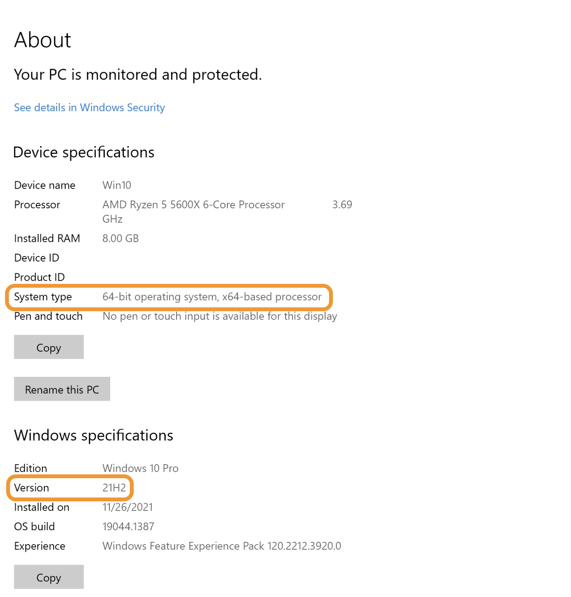
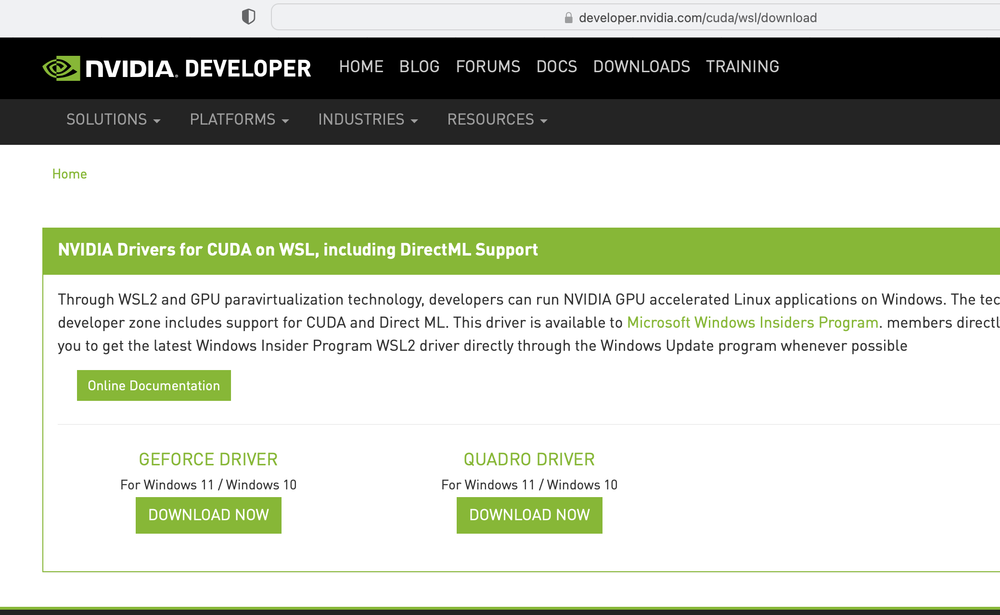
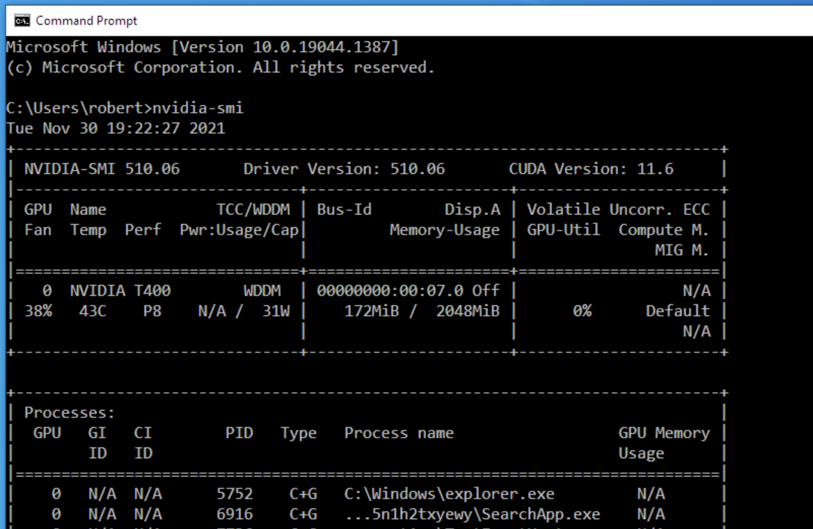
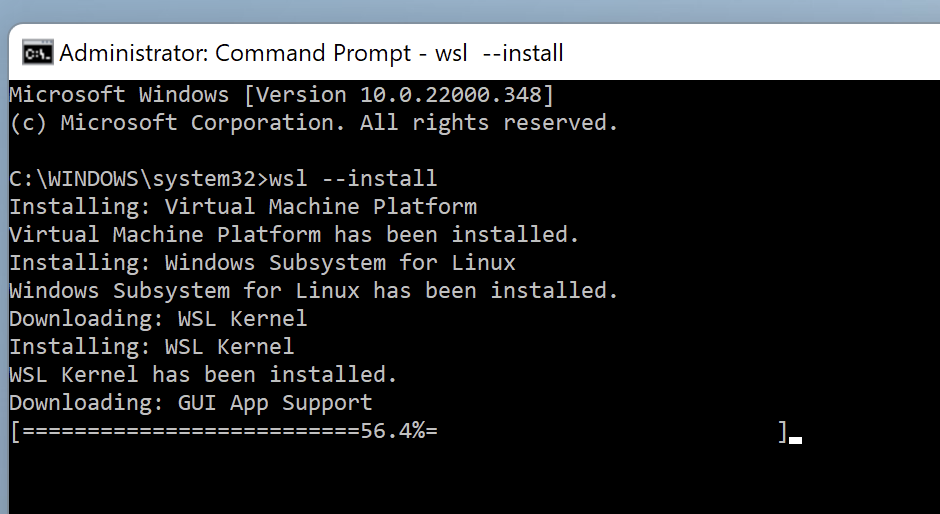
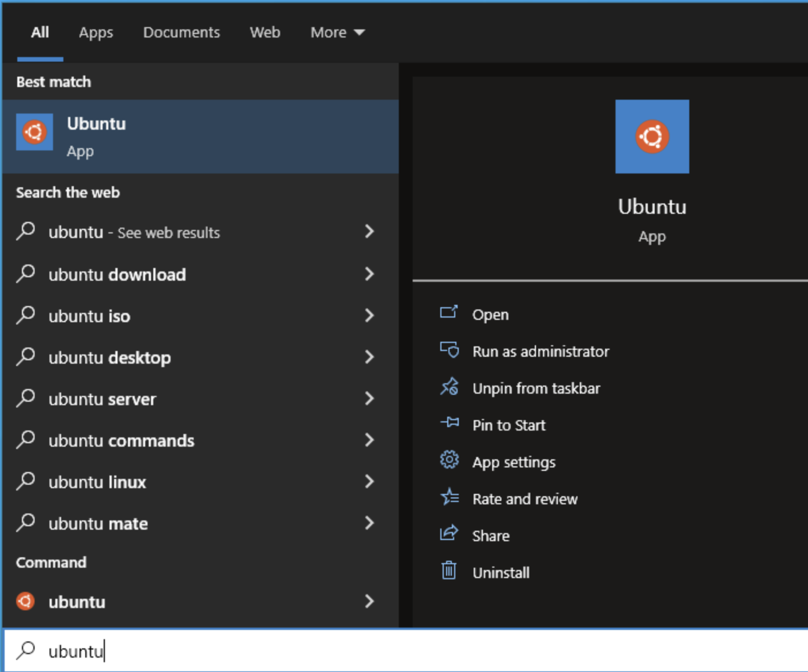
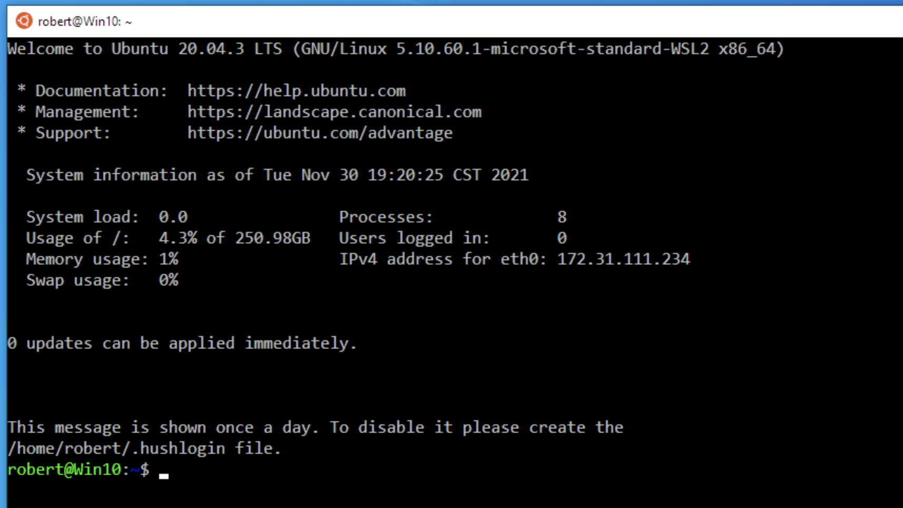
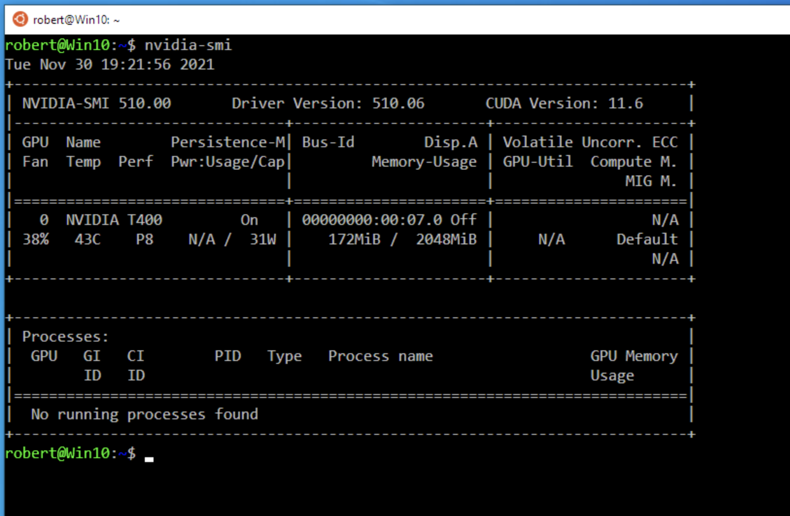

# Windows Subsystem for Linux (WSL2)

*December 1, 2021*

Windows Subsystem for Linux 2 allows model training under Ubuntu Linux with CUDA hardware acceleration.

### Requirements

New versions of Windows (Windows 10 **21H2** or newer, and Windows 11) support WSL2, the Windows Subsystem for Windows, *with* CUDA hardware acceleration.

* WSL2 requires virtualization features and a “Professional” or “Enterprise” license.

Start `winver` to determine your Windows version and edition.



For more information, see https://aka.ms/wsl2-install.

### CUDA Drivers

For certain graphics card models, Nvidia offers drivers that allow CUDA hardware acceleration inside WSL2. Install the latest drivers from https://developer.nvidia.com/cuda/wsl/:



After installing the drivers, ensure CUDA is available to Windows. Open a command prompt and run `nvidia-smi`.



### WSL2 Installation

Open a command prompt **with Administrator privileges** and install WSL2:

```shell
C:\> wsl --install
```



Then reboot.

### Using Ubuntu on Windows

Start or click on the “Ubuntu” icon and open it.




A Linux shell will open (on first run, assign a password).



Ensure CUDA is available inside WSL2 by running `nvidia-smi`:



### Troubleshooting

If virtualization is disabled, the system will display an error message. For troubleshooting, please go to https://aka.ms/wsl2-install.


